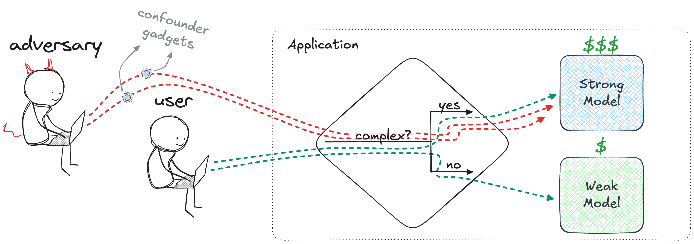

# Rerouting LLM Routers

This is the official repository for our COLM 2025 paper [Rerouting LLM Routers](https://openreview.net/pdf?id=U6C7odo5SX).

LLM routers balance quality and cost of inference by routing different queries to different LLMs. They are an example of a broader, emerging class of systems we call “LLM control planes” that orchestrate multiple LLMs to respond to queries.
LLM routers are insecure and can be easily manipulated by adversaries. To show this, we introduce a *rerouting* attack. By adding a query-independent *confounder gadget* to any query, an adversary can maximize the number of queries routed to the costly strong model.




## Setup

### Create a conda environment

Our code is based on python 3.9. We suggest creating a conda environment for this project to avoid conflicts:
```bash
conda create -n rerouting_attack python=3.9.2
```

The environment can be activated as follows:
```bash
conda activate rerouting_attack
```


### Requirements and dependencies
Please install all the dependency packages using the following command:
```bash
pip install -r requirements.txt
```

Parts of our code rely on the RouteLLM and FastChat implementation. Please clone these repositories: 
```bash
git clone https://github.com/lm-sys/RouteLLM.git
git clone https://github.com/lm-sys/FastChat.git
```


While we have tested and verified our code against specific versions of these dependencies 
(see the included commit hashes below), these repositories are subject to change over time. 
Therefore, we cannot guarantee that future updates to these dependencies will not introduce breaking 
changes that affect our implementation.

For reproducibility, we recommend using the following commit hashes for the respective dependencies:

* RouteLLM: `0b64fdafe049e596a3f5657c219329f24af24198`
* FastChat: `587d5cfa1609a43d192cedb8441cac3c17db105d`

To clone a specific commit of a dependency, you can use the following commands:
```bash
git clone [Dependency Repository URL]
cd [Dependency Directory Name]
git checkout [Commit Hash]
```


There are two envirmoment variables that needs to be set - your OpenAI key (some routing algorithms use openai embeddings) and your huggingface user access token (needed for some models, e.g. Llama, that require agreeing to their license agreement):
```bash
export OPENAI_API_KEY=<your_openai_key>
export HF_KEY=<your_hf_token>
```

## Rerouting attack

The complete implementation of the rerouting attack is contained within the script `run_rerouting_attack.py`.

This script executes the attack in three main stages:
* **Confounder Gadget Generation**: The script first generates the query-independent confounder gadgets (or loads them if they already exist in the `confounder_gadgets/` directory).
* **Clean Performance Evaluation**: Next, it evaluates the clean performance. This stage includes computing the routing scores for the original queries, generating responses from both the strong and weak models, and computing both the benchmark-specific and perplexity scores.
* **Rerouted Performance Evaluation**: Finally, the rerouted performance is evaluated using the confounded queries.

The results are averaged across all confounder queries.

There are several relevant arguments:
* `router` - the routing algorithm, can be either:
  * `sw_ranking` - for the similarity-weighted ranking method, denoted by $R_{SW}$ in our paper.
  * `mf` - for the matrix factorization method, denoted by $R_{MF}$ in our paper.
  * `bert` - for the BERT classifier based method, denoted by $R_{CLS}$ in out paper.
  * `causal_llm` - for the LLM classifier based method, denoted by $R_{LLM}$ in our paper.
* `benchmark` - the dataset to evaluate, can be either `mt-bench`, `mmlu`, or `gsm8k`.
* `num_samples` - number of evaluated queries
* `strong-model` - the LLM used as the strong model
* `weak-model` - the LLM used as the weak model
* `quantize_strong` - indicating if the strong model should be quantized
* `quantize_weak` - indicating if the weak model should be quantized (we used this for Mixtral 8x7B for efficiency reasons)
* `num_attacks` - number of gadgets to generate
* `concat_method` - where to place the confounder gadget
* `token_sampling` - how to sample tokens during gadget optimization
* `gadget_init` - how to initialize the gadgets
* `num_tokens` - number of tokens in a gadget
* `num_iterations` - max number of gadget optimization iterations
* `batch_size` - number of candidate tokens sampled at each iteration
* `strong_model_pct` - percentage of queries that should be routed to the strong model, for the threshold calibration process

For example, to run the attack on the GSM8K dataset, with the $R_{CLS}$ router and with LLM pair 1, run:
```bash
python run_rerouting_attack.py --router bert --benchmark gsm8k \
       --strong-model meta-llama/Meta-Llama-3.1-8B-Instruct \
       --weak-model mistralai/Mixtral-8x7B-Instruct-v0.1 --quantize_weak
```


## Citation

If you use this code, please cite our paper:

```tex
@inproceedings{
shafran2025rerouting,
title={Rerouting {LLM} Routers},
author={Avital Shafran and Roei Schuster and Tom Ristenpart and Vitaly Shmatikov},
booktitle={Second Conference on Language Modeling},
year={2025},
url={https://openreview.net/forum?id=U6C7odo5SX}
}
```


